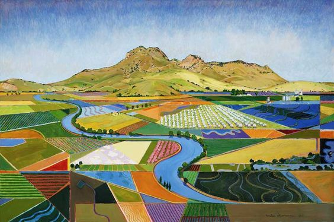

# Data


## Delta Science Tracker   

This workshop uses publicly available data from the Delta Stewardship Council's (DSC) [Delta Science Tracker](https://sciencetracker.deltacouncil.ca.gov/). This database is a library of Sacramento and San Joaquin Delta-related research over the last 50 years. As the DSC's website explains:  

> "The Delta Science Tracker is a tool to improve coordination and collaboration of science activities in a way that is valuable to scientists, decision-makers, and managers in the Delta. The Delta Science Tracker allows users to explore and visualize recent research and monitoring efforts through the lenses of science activities, organizations, and people. It is intended to promote communication, create opportunities for collaboration, and enhance transparency for science funding opportunities and decisions."  


The data we're using was downloaded from the DSC's [visualizations page](https://sciencetracker.deltacouncil.ca.gov/visualizations), with the 'collaborations by' filter set to organizations. Additional data were obtained through scraping their webpage, which we did with permission from the DSC. Code for scraping their webpage can be found [here](https://github.com/ucdavisdatalab/workshop_network_viz/blob/main/scraping_data.R).

<div class="figure" style="text-align: center">

<p class="caption">(\#fig:unnamed-chunk-1)Miles Hermann</p>
</div>

## Data descriptions  

Before getting started with visualizations, we want to take a look at the data we have available. Typical questions you should be able to answer before getting started are as follows: What types of nodes do we have and how are they related? What node and/or edge attributes are available? Are the network data one or two mode? Directed or undirected? Let's take a look at what we have.  

**Two-mode edge list:** The DSC data was originally compiled as two-mode network data, describing how organizations/researchers are connected to research projects. In these data, our first mode, `org_id`, is the organization(s) (agencies, universities, etc) that are working on projects in the Delta. And our second mode, `project_id`, are the Delta science research projects themselves. This two-mode edge list has 680 rows, whereby 138 organizations are connected with one or more of 297 projects. In these data, organizations often take part in more than one project, and projects often have more than one organizations associated with it. We also have edge attributes, which represent the kind of role an organization has in the project: contributor or leader.  


```r
edges_2mode <- read.csv('https://raw.githubusercontent.com/ucdavisdatalab/workshop_network_viz/main/data/edgelist_twomode.csv')
dim(edges_2mode)
```

```
## [1] 680   4
```


```r
head(edges_2mode)
```

```
##   org_id project_id contribution leadership
## 1  49590      50122         TRUE      FALSE
## 2  49592      49780         TRUE      FALSE
## 3  49592      49865         TRUE      FALSE
## 4  49594      49860         TRUE      FALSE
## 5  49598      50091         TRUE      FALSE
## 6  49600      50170         TRUE      FALSE
```


**Node list for two-mode network**: We also have a list of all the nodes (organizations and projects), each of which has different attributes. We have more node attributes for project nodes than we do for organization nodes, so many of the attributes for organizations are empty. For projects, we have funding data, the dates of the project, as well as a series of categorical tags related to what kinds of scientific and management themes the project addresses. A sample of those are displayed below:  


```r
nodes_2mode <- read.csv('https://raw.githubusercontent.com/ucdavisdatalab/workshop_network_viz/main/data/nodelist_twomode.csv')
head(nodes_2mode[,c(1,4,6,16,31,39)])
```

```
##      id    funds startdate sci_Channelizedhabitats sci_Amphibiansandreptiles
## 1 50122       $0      2008                   FALSE                     FALSE
## 2 49780       $0      2020                   FALSE                     FALSE
## 3 49865 $445,921      2019                   FALSE                     FALSE
## 4 49860 $931,104      2019                   FALSE                     FALSE
## 5 50091       $0        NA                   FALSE                     FALSE
## 6 50170       $0        NA                   FALSE                     FALSE
##   mgmt_Governance
## 1           FALSE
## 2           FALSE
## 3           FALSE
## 4           FALSE
## 5           FALSE
## 6           FALSE
```

Note that the scientific and management themes are formatted as logical values for each theme. This is because projects can have more than one theme, and so listing them out would cause our data to be 'long' with repeated project observations. With node lists, we want to only have unique observations. If your data are 'long' (with repeating observations), widen them out as we did with the scientific and management themes.  

**One-mode edge list:** We projected our two-mode network to a one-mode network to take a deeper look at research collaborations. Projection of two-mode data into one-mode is a common practice, though it has its limitations (Jasny 2012)^[Jasny, Lorien. “Baseline Models for Two-Mode Social Network Data.” Policy Studies Journal 40, no. 3 (2012): 458–91. https://doi.org/10.1111/j.1541-0072.2012.00461.x.]. By converting two-mode into one-mode data, we can take a look at what organizations are working together on projects. Looking at the dimensions of our data, we have 475 collaborative ties in the network.  We've also added in an edge attribute to our collaboration tie based on the years that different actors collaborated together. Reveal below for more on how to project one-mode data from two-mode data.  


```r
edges_1mode <- read.csv('https://raw.githubusercontent.com/ucdavisdatalab/workshop_network_viz/main/data/edgelist_onemode_projected.csv') 
dim(edges_1mode)
```

```
## [1] 475   6
```


```r
head(edges_1mode)
```

```
##   from_org_id to_org_id Y1995_2009 Y2010_2024 before_1980 Y1980_1994
## 1       49590     49709       TRUE      FALSE       FALSE      FALSE
## 2       49592     49708      FALSE       TRUE       FALSE      FALSE
## 3       49592     49741      FALSE       TRUE       FALSE      FALSE
## 4       49592     49609      FALSE       TRUE       FALSE      FALSE
## 5       49708     49741      FALSE       TRUE       FALSE      FALSE
## 6       49609     49708      FALSE       TRUE       FALSE      FALSE
```

<details>
<summary>**Reveal:** How to project one-mode networks from two-mode edge list</summary>


```r
# We got our projected data directly from the DST webpage, but generally,
# you can project any bipartite network into a one-mode network using the
# following steps:

# 1. Create count table where organizations are columns (make your mode of
#    interest the 2nd/y argument in the table)
tbl <- table(edges_2mode[c(2,1)])
# 2. Extract column names -- these are mode 1 names (in our case, orgs)
orgids <- colnames(tbl)
# 3. Take the cross-product of the table to get a co-occurence matrix
comat <- crossprod(tbl)
# 4. Assign self-co-occurrences 0
diag(comat) <- 0
#   Check: This should be symmetrical
isSymmetric(comat)
# 5. Make a data frame from the matrix and add ids as the column names
comat <- data.frame(comat)
colnames(comat) <- orgids
#.  Check: This should be square
dim(comat)
# 6. Remove those with no co-occurrence at all
comat <- comat[rowSums(comat, na.rm = T) != 0, 
               colSums(comat, na.rm = T) != 0]
# 7. Make co-occur data frame into matrix object
comat <- as.matrix(comat)
# 8. Create a graph so that it can be converted into a weighted edge list
g <- igraph::graph_from_adjacency_matrix(comat, weighted = T, mode = 'undirected')
el_proj <- igraph::get.data.frame(g)
```
</details>
<br>

**Node list for one-mode network**: We reduced our two-mode node list down to only a list of our organization nodes, which is what we project in our one-mode network. For organizations, we have very few attributes, only their id, name, and link to their DST page. 


