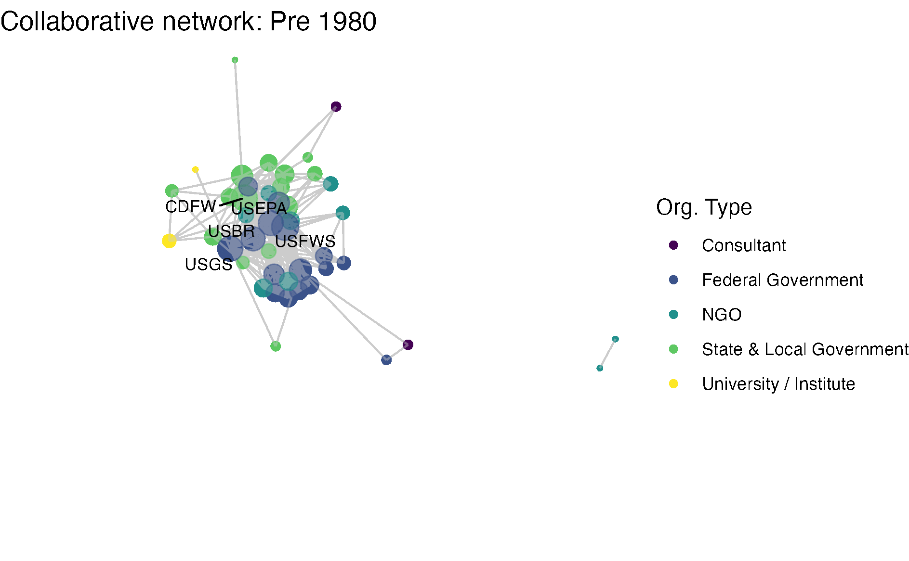

# One-mode visualization

```{r, setup, include=FALSE}
knitr::opts_chunk$set(warning = F, message = F)
```

```{r, warning = F, message = F, echo = F}
library(igraph)
library(network)

edges_1mode <- read.csv('data/edgelist_onemode_projected.csv')
nodes_1mode <- read.csv('data/nodelist_onemode.csv')

net1 <- network(x = edges_1mode, 
               vertices = nodes_1mode,
               bipartite = F,  
               directed = F)
g1 <- igraph::graph_from_data_frame(edges_1mode, vertices = nodes_1mode, directed = F)
```

## Introduction  

Before we get started plotting `network` objects in `ggraph`, let's also load in three more packages. The `sna` package provides us with several functions for calculating network statistics, and `dplyr` and `magrittr` are packages from that tidyverse that will help us streamline our plotting.  

```{r}
library(sna)
library(dplyr)
library(magrittr)
```

## Guiding questions  

As with any visualization, we need to have an idea of [what stories we want to tell](https://ucdavisdatalab.github.io/workshop_data_viz_principles/before-you-viz-make-a-plan.html) / what questions we want to answer. Exploring visualizations without certain goals in mind is hard, and so throughout these plotting exercises we will have guiding questions that can keep us focused on what is important as we navigate the wide array of visualization options.  

For our one-mode visualization we will focus on the following questions:  

1. What organizations are most central to the collaborative research network in the Delta?
2. How have the Delta's research collaborations changed over time? 

## Getting started with `ggraph`

For this workshop we will use the [`ggraph` package](https://cran.r-project.org/web/packages/ggraph/ggraph.pdf) (and function) for network visualization, created by Thomas Lin Pedersen, who also happens to make 'generative' artwork in R. 

```{r echo=FALSE, out.width= '75%', fig.show="hold", fig.align='center', fig.cap='Thomas Lin Pedersen generative art with ggraph'}
knitr::include_graphics("img/winds2020.jpeg")
```

`ggraph` relies on (and is a wrapper around) `ggplot2`, so it follows the same grammar of graphics approach. Let's load in the `ggraph` package.

```{r}
library(ggraph)
```

Just as in `ggplot`, `ggraph` has three core components:  
1. (network) data  
2. aesthetic mappings    
3. geometries (in this case edges and nodes)   

We can combine the `ggraph()` function with a geometry specific to networks, `geom_node_point()`, to see the nodes as points. To connect these points, we can use an 'edge link' geometry, `geom_edge_link()`, which uses the network object's built in x, y, (and xend, and yend) variables for the edge data. 

```{r, message = T, fig.align='center'}
ggraph(net1) +
    geom_node_point() +
    geom_edge_link()
```

What's special here is that `ggraph` uses an algorithm to assign x and y mapping coordinates (more on that in a minute), so we don't need to specify mapping arguments. You can check it out under the hood by looking at the object of the `ggraph` function:

```{r}
ggraph_obj <- ggraph(net1)
head(ggraph_obj$data)
```

Just as in `ggplot`, we can use the ` + ` symbol to layer on plot features, such as themes. For example, the `theme_void()` can help us focus in on the network visualization itself. 

```{r, message = T, fig.align= 'center'}
ggraph(net1) +
    geom_node_point() +
    geom_edge_link() +
    theme_void()
```

Note how we are alerted that the node point geometry uses a default layout based on the 'stress' algorithm to assign its x and y coordinates for plotting the node points as we see above. So next we'll talk about layout algorithms.

### Layouts

Networks are typically laid out based on the algorithm you (or the package default) chooses. Layouts are a _choice_ based on how you would like to present the network. Because networks are depicting actors and relationships in an two-dimensional space (x, y), there is no 'right' way to plot actors in space (unless, of course, you have actual spatial data associated with your nodes, in which case you could use a geospatial network mapping (e.g. [flight route maps](https://www.igismap.com/flight-routes-network-analysis/))). 

For scenarios without geospatial coordinates, network theorists have developed layout algorithms which define rules for calculating the x and y coordinates of the nodes. Many layout algorithms aim to represent networks so that strongly connected nodes are plotted in close proximity to one another, representing a 'core' and a 'periphery'.  

There is an overview of `ggraph`'s different layouts presented in this [blog post ](https://www.data-imaginist.com/2017/ggraph-introduction-layouts/), and descriptions of some of them in the [ggraph vignette](https://cran.r-project.org/web/packages/ggraph/vignettes/Layouts.html) and [documentation](https://cran.r-project.org/web/packages/ggraph/ggraph.pdf), under the `layout_tbl_graph_...` functions. The layout is selected with the 'layout' argument within the `ggraph` function. Below we present our network with a few different layouts.  

```{r, out.width= c("50%", "50%"), fig.show="hold", echo = F}
ggraph(net1, layout = 'stress', bbox = 5) +
    geom_edge_link() +
    geom_node_point() +
    theme_void() +
    labs(title = 'Stress: `layout = "stress", bbox = 5`') +
    theme(plot.title = element_text(hjust = 0.5))

ggraph(net1, layout = 'kk') +
    geom_edge_link() +
    geom_node_point() +
    theme_void() +
    labs(title = 'Kamada and Kawai (spring-based algorithm): `layout = "kk"`')  +
    theme(plot.title = element_text(hjust = 0.5))

ggraph(net1, layout = 'fr') +
    geom_edge_link() +
    geom_node_point() +
    theme_void() +
    labs(title = 'Fruchterman and Reingold (force-directed algorithm): `layout = "fr"`')  +
    theme(plot.title = element_text(hjust = 0.5))

ggraph(net1, layout = 'circle') +
    geom_edge_link() +
    geom_node_point() +
    theme_void()  +
    labs(title = 'Circle: `layout = "circle"`')  +
    theme(plot.title = element_text(hjust = 0.5))
```

Note that there is a whole world of plotting networks using [different conceptualizations of nodes](https://cran.r-project.org/web/packages/ggraph/vignettes/Nodes.html) and [edges](https://cran.r-project.org/web/packages/ggraph/vignettes/Edges.html). These conceptualizations of nodes and edges may be dependent on certain layout algorithms. For example, if working with a 'tree' based layout, which creates more of a hierarchical structure like a dendrogram, edges as lines may not be suited. Instead, you can specify different edges (e.g. diagonals).  

```{r, echo = T,  out.width = "50%", fig.align='center', echo = F}
ggraph(net1, layout = 'tree') +
    geom_edge_diagonal() +
    theme_void() +
    labs(title = 'Tree: `layout = "tree"`') +
    theme(plot.title = element_text(hjust = 0.5))
```


For the sake of this workshop we are sticking to more 'traditional' network visualization, so we will only be depicting nodes as points and edges as lines.  
 
You can also set a **manual layout**. Because layouts are just x and y coordinates of points defined by a certain algorithm, you can extract those coordinates using the `create_layout()` function from `ggraph`, and fix and/or manipulate those coordinates, if need be. We will deal with this more in the longitudinal networks section.    

```{r}
fixed_coord <- create_layout(net1, layout = 'fr')
head(fixed_coord[c(1:2,5)])
```

For our one-mode networks, we are going to use the 'fr' layout, which is the Fruchterman and Reingold (force-directed algorithm). This is a choice that helps place higher-degree nodes in the center, and low-degree and isolate nodes on the periphery. 

```{r, fig.align= 'center'}
ggraph(net1, layout = 'fr') +
    geom_node_point() +
    geom_edge_link() +
    theme_void()
```

### Aesthetics features  

Now that we've chosen a layout, let's start adding some aesthetic features. This process will look very much like aesthetic mapping in `ggplot2`: we can assign aesthetics like color, size, shape, etc., and these features can either be directly related to the data (i.e. data features) or more generic plot features.  

As we build out the basics of the `ggraph` package, we're going to focus on our first question: _What organizations are most central to the collaborative research network in the Delta?_ 

**Size by degree**: One common approach for network visualization is to size nodes by their degree centrality. While more central nodes are already placed at the center of our layout's algorithm, it can be helpful to also increase their size to communicate this point by adding a data feature. To size by degree, we will want to create a degree variable as a node attribute using the `degree` function, and assign that attribute to our network data.  

```{r}
net1 %v% 'degree' <- sna::degree(net1)
```

Hint: if you get `Error in degree(net1) : Not a graph object`, double check that you have detached the `igraph` package!  

**Color by organization type**: We'd also like our nodes and edges to be colored differently than the default black, so we can set these colors to our geometries as a plot feature. Because the focus of these networks are on nodes, not edges, we can set our edges to a less pronounced color like grey. For nodes, we might what to color them by a node attribute to add more information to our figure. Specifically to help answer our first guiding question, we'd like to color nodes by the nodes' organizational types attribute, so we can better understand the groups that are represents (e.g. local government or university?)

<!-----
```{r}
viridis::viridis(12)
```

The latest version of R studio lets us see these colors when we write them out in a script, so let's do that, and assign these colors to an object named `clrs`. We will be referencing this vector as we start using the palette.

```{r}
clrs <- c("#440154FF", "#482173FF", "#433E85FF", "#38598CFF",
          "#2D708EFF", "#25858EFF", "#1E9B8AFF", "#2BB07FFF", 
          "#51C56AFF", "#85D54AFF", "#C2DF23FF", "#FDE725FF")
```
----->
We can now integrate these three features: node size and node color, which are stored in our network data, as well as edge color, which will be set without reference to the data.   

```{r, fig.align= 'center'}
ggraph(net1, layout = 'fr') +
  geom_node_point(aes(size = degree, color = org_type)) +
  geom_edge_link(color = "gray80") +
  theme_void()
```

Notice how layer order matters (as as with `ggplot2`), and so by having edges layered on top of nodes, we are really hiding the nodes. Let's try to switch this, but also include some alpha arguments to help increase transparency.  

```{r, fig.align= 'center'}
ggraph(net1, layout = 'fr') +
  geom_edge_link(color = "gray80") +
  geom_node_point(aes(size = degree, color = org_type, alpha = .9)) +
  theme_void()
```

We might also want to select a color-blind friendly palette to color our nodes, rather than R's default. Let's go ahead and use the `viridis` functionality built into ggplot:

```{r, fig.align= 'center'}
ggraph(net1, layout = 'fr') +
  geom_edge_link(color = "gray80") +
  geom_node_point(aes(size = degree, color = org_type, alpha = .9)) +
  scale_color_viridis_d() +
  theme_void()
```

<!----
Note: The approach we will take for this workshop is to assign attributes to the network data frame, then add them into our plotting aesthetics. There is also some [compatibility with tidyverse's graph package, tidygraph](https://cran.r-project.org/web/packages/ggraph/vignettes/tidygraph.html), which we could use to set network aesthetics directly in the plotting functions (below), but we will not really be exploring that today. 

```{r}
ggraph(net1, layout = 'fr') +
  geom_edge_link(color = "gray70") +
  geom_node_point(aes(size = tidygraph::centrality_degree()), 
                  color = clrs[4], alpha = .8) +
  theme_void()
```
---->

We can also make thematic alterations such as adding a title label to the plot and removing the degree legend with guide.  

```{r, fig.align= 'center'}
ggraph(net1, layout = 'fr') +
  geom_edge_link(color = "gray80") +
  geom_node_point(aes(size = degree, color = org_type, alpha = .9)) +
  scale_color_viridis_d() +
  theme_void() +
  labs(title = "Delta Science Collaborative Research Network", color = "Org. Type") +
  guides(colour = "legend", size = "none", alpha = "none")
```

Notice that with the 'fr' layout (and any other layout algorithm), the coordinates change a bit every time. This is because each time we create a visualization the algorithm is re-run, and there is variation in the exact calculation. You can set your seed (every time before you plot) to keep it consistent.

### Node labels 

So far we are getting a clear shape of the network. But related to our first question we want to understand  _who_ is central to collaboration. To better identify our nodes, let's try to add some node text with the `geom_node_text()` geometry. Already, we have a variable that is the name of our vertices:

```{r}
head(net1 %v% 'name')
```
Let's add this as a text geometry.  

```{r, fig.align= 'center'}
ggraph(net1, layout = 'fr') +
  geom_edge_link(color = "gray80") +
  geom_node_point(aes(size = degree, color = org_type, alpha = .9)) +
  scale_color_viridis_d() +
  theme_void() +
  labs(title = "Delta Science Collaborative Research Network", color = "Org. Type") +
  guides(colour = "legend", size = "none", alpha = "none") +
  geom_node_text(aes(label = name),
                size = 3, 
                color="black")
```

Okay, a bit overwhelming. Instead, let's be selective based on degree. Let's say we want to take the top 5-degree nodes and label them.

```{r}
# Extract the network's degree values based on the order of degrees
degs <- (net1 %v% 'degree')[order(net1 %v% 'degree', decreasing = T)]
# Then identify the top 5 unique degree values
topdegs <- unique(degs)[1:5]
# Then create a network variable named labels and add the name only if a
# node has the number of degrees in the 'top degrees'
net1 %v% 'labels' <- ifelse((net1 %v% 'degree') %in% topdegs, 
                           net1 %v% 'name', NA)
```

Now we have a sparse label attribute.  

```{r}
net1 %v% 'labels'
```

We can use this labels attribute to make our figure more easily readable.  

```{r, fig.align= 'center', warning = F}
ggraph(net1, layout = 'fr') +
  geom_edge_link(color = "gray80") +
  geom_node_point(aes(size = degree, color = org_type, alpha = .9)) +
  scale_color_viridis_d() +
  theme_void() +
  labs(title = "Delta Science Collaborative Research Network", color = "Org. Type") +
  guides(colour = "legend", size = "none", alpha = "none") +
  geom_node_text(aes(label = labels),
                   size = 3)
```

Almost. Let's include a repel = T argument to make sure the text doesn't overlap. 

```{r, fig.align= 'center', warning = F}
ggraph(net1, layout = 'fr') +
  geom_edge_link(color = "gray80") +
  geom_node_point(aes(size = degree, color = org_type, alpha = .9)) +
  scale_color_viridis_d() +
  theme_void() +
  labs(title = "Delta Science Collaborative Research Network", color = "Org. Type") +
  guides(colour = "legend", size = "none", alpha = "none") + 
  geom_node_text(aes(label = labels),
                   size = 3,
                   repel = T)
```

So, _what organizations are most central to the collaborative research network in the Delta?_ This network shows us the overall structure of collaboration, and we can use summary statistics to fill in the gaps. At the center of the network are three federal agencies, the [US Geological Survey (USGS)](https://sciencetracker.deltacouncil.ca.gov/node/49743), [US Fish and Wildlife Service (USFWS)](https://sciencetracker.deltacouncil.ca.gov/node/49741), and [US Bureau of Reclamation (USBR)](https://sciencetracker.deltacouncil.ca.gov/node/49731), two state agencies, [California Department of Fish and Wildlife (CDFW)](https://sciencetracker.deltacouncil.ca.gov/node/49602) and [California Department of Water Resources (DWR)](https://sciencetracker.deltacouncil.ca.gov/node/49609) one research institute, the [San Francisco Estuary Institute (SFEI)](https://sciencetracker.deltacouncil.ca.gov/node/49707). 

Among the 139 organizations involved in scientific research in the Delta, there is a mean degree of 14, suggesting that organizations are involved with, on average, 14 other organizations (across one or more projects). The network is quite connected, as the main component includes 107 (77%) of the organizations, with 27 isolates, meaning that 27 organizations have not collaborated at all. Within that main component, the average path length is 2.3, meaning that on average an organization is less then 3 connections away from any other organization. 

<details>
<summary>**Bonus code:** How to calculate network-level statistics with the `sna` package </summary>
```{r, purl = T}
network.size(net1)
mean(net1 %v% 'degree')
sum(component.largest(net1))
length(isolates(net1))
main_comp <- component.largest(net1, result = 'graph')
mean(geodist(main_comp)[['gdist']], na.rm = T)
```
</details>
<br>

### Network plotting function  

Now that we've got that down as a base, I want to define this network visualization approach as a function so that we can move through other material a little more smoothly. Feel free to just copy this function -- all we are doing is taking the code we previously wrote, and replacing the network name that we've been using, net1, with the generic argument for the network name, 'netname'. 

```{r}
netplot_function <- function(netname){
  p <- ggraph(netname, layout = 'fr') +
         geom_edge_link(color = "gray80") +
         geom_node_point(aes(size = degree, color = org_type, alpha = .9)) +
         scale_color_viridis_d() +
         theme_void() +
         labs(title = "Delta Science Collaborative Research Network", color = "Org. Type") +
         guides(colour = "legend", size = "none", alpha = "none") +
         geom_node_text(aes(label = labels),
                          size = 3,
                          repel = T)
  return(p)
}
```

### Removing isolates 

Before we move too far along in our formatting of this figure, we may want to remove isolates. There are certainly occasions where we _want_ to see isolates in our network, but other times we are interested in the main component. We can identify our isolates with the `isolates` function and then induce our subgraph with only the non-isolate nodes using the `get.inducedSubgraph()` function.  

The isolates function identified the numeric id of the node in a network, not associated with a particular network attribute. 
```{r}
isolates(net1)
```

As a result, we want to identify the ids of the network that are not isolates, which we can do by indexing the ids from the size of the network.

```{r}
noiso <- (1:network.size(net1))[-isolates(net1)]
noiso
```

Then we use those to induce the subgraph with only certain vertices. 
```{r}
net1_noiso <- get.inducedSubgraph(net1, v = noiso)
```

Now we can see our network without isolates, and quickly use our new `netplot_function`:  

```{r, fig.align= 'center'}
netplot_function(net1_noiso)
```

## Longitudinal networks  

Lets now turn to think more deeply about edges with the second guiding question: _How have the Delta's research collaborations changed over time?_ So far we've been looking at all of the research collaborations in the DST database, which range from 1950 to more or less present day. But remember that our data have edge attributes based on when the collaborative project occurred, binned into 4 time periods: Before 1980, 1980-1994, 1995-2009, and 2010-2024 (including ongoing projects). 

```{r}
net1
```

### Faceting edges  

One way to visualize subgraphs based on certain edge or node attributes is to use the `facet_edges` or `facet_nodes` functions in `ggraph`. Just like in `ggplot`, faceting can add another dimension to the data by breaking it out using certain categorical variables. 

```{r, warning = F}
netplot_function(net1_noiso) +
  facet_edges(~before_1980)
```

This might be an worthwhile approach with different data and visualization goals, but with these data there are two drawbacks: 

1. First and generally, faceting does not customize aesthetics such as degree size or label for each subgraph. It keeps the same degree size and assigned labels identified for the complete network, which misrepresents the connections in each subgraph.  
2. Second for our data, we have 'wide' edge attributes, where each relationship in our data can occur across multiple time periods. That means given our current data structure, we can't represent the collaborative relationships across time using faceting. One strategy to address this would be to restructure our edge list and create a new network. We aren't going to go down this road but if you're interested there is some bonus code below. Instead, we're going to take a second strategy which is to manually induce each subgraph in order to better customize the plots.  

<details>
<summary>**Bonus code:** How to lengthen the edge list to create a weighted network and facet using a single edge attribute </summary>
```{r}
# lengthen the edge list
edges_1mode_long <- tidyr::pivot_longer(edges_1mode,
                                        Y1995_2009:Y1980_1994,
                                        names_to = "timeframe",
                                        values_to = "logical") %>% 
  dplyr::filter(logical == T) %>% 
  dplyr::select(-logical)

# Now we create a network but with the long edges, but because the lengthening
# process means we have multiple edges per pair, we need to set multiple = T
net1_long <- network(x = edges_1mode_long, 
                     vertices = nodes_1mode,
                     bipartite = F,  
                     directed = F,
                     multiple = T)
# Now we can facet by our single time column, time frame; we'll remove the 
# aesthetics that don' carry over
ggraph(net1_long, layout = 'fr') +
         geom_edge_link(color = "gray80") +
         geom_node_point(aes(color = org_type, alpha = .9)) +
         theme_void() +
         facet_edges(~timeframe)
```
</details>

### Inducing subgraphs by edge attribute  

To visualize how our networks change over time we are going to be 'inducing subgraphs', which is a network phrase for taking slices of our network. Networks can be induced based on certain nodes, which we just did in order to remove isolates. But for this question we will be making subgraphs based on edge attributes. 

To induce our network based on edge attributes, we'll want to identify which edges have those attributes. We can identify the edge ids for which each time category is equal to TRUE. We have these are four binary variables, rather than one attribute with four time categories, because organizations can collaborate on projects in more than one time period. 

```{r}
# First, let's give these ids, which will become important later
net1 %v% 'id' <- net1 %v% 'vertex.names'
```

```{r}
# Get the edges for each time period
t1 <- which(net1 %e% 'before_1980' == T)
t2 <- which(net1 %e% 'Y1980_1994' == T)
t3 <- which(net1 %e% 'Y1995_2009' == T)
t4 <- which(net1 %e% 'Y2010_2024' == T)
# These are the ids of their location in the network. For example:
t1
```

Now that we have our edge ids for each time period (t1 through t4), we can use the `get.inducedSubgraph` function and identify the edge ids that we'd like to keep in each network.  
```{r}
# Induce subgraphs based on edges
net1_t1 <- get.inducedSubgraph(net1, eid = t1)
net1_t2 <- get.inducedSubgraph(net1, eid = t2)
net1_t3 <- get.inducedSubgraph(net1, eid = t3)
net1_t4 <- get.inducedSubgraph(net1, eid = t4)
```

```{r, echo = F, eval = F}
# Get the edges for each time period -- this is just a check
t1_edges <- filter(edges_1mode, before_1980 == T)
t2_edges <- filter(edges_1mode, Y1980_1994 == T)
t3_edges <- filter(edges_1mode, Y1995_2009 == T)
t4_edges <- filter(edges_1mode, Y2010_2024 == T)
```

Now we have a slice of the network for each time period. Note that because we did not specify the vertex ids, these networks will include only the nodes that has connections for that time period, and it will not include isolates. For example, though our whole collaborative network has 139 nodes, the network from time period 2 has only 30. 

```{r}
net1_t2
```

With these induced networks, an important thing to notice is that the attributes assigned in the complete network remain. This is is less important for exogenous, fixed attributes like name, but is important for endogenous/structural attributes like degree. For example, we can check the degree of SFEI in two different networks against the whole network and see that the degree attribute has carried over, but that calculation is no longer correct in the induced networks.  
```{r}
(net1 %v% 'degree')[(net1 %v% 'name' == "SFEI")]
(net1_t1 %v% 'degree')[(net1_t1 %v% 'name' == "SFEI")]
(net1_t2 %v% 'degree')[(net1_t2 %v% 'name' == "SFEI")]
```

We need to update/reassign any structural values that we calculated for the whole network so that they are accurate for each sub-network. 
```{r}
net1_t1 %v% 'degree' <- degree(net1_t1)
net1_t2 %v% 'degree' <- degree(net1_t2)
net1_t3 %v% 'degree' <- degree(net1_t3)
net1_t4 %v% 'degree' <- degree(net1_t4)
```

Just as the degree attribute needed changed, we also need to change the the label attribute, which was assigned based on degree. We can write a function to do that to avoid repetition across each time period.  

```{r}
label_top_degree <- function(netname, n){
  degs <- (netname %v% 'degree')[order(netname %v% 'degree', decreasing = T)]
  topdegs <- unique(degs)[1:n]
  labels <- ifelse((netname %v% 'degree') %in% topdegs, 
                           netname %v% 'name', '')
  return(labels)
}
```

Then we can apply that function to each subgraph, specifying that we want the top 5 names for each. 
```{r}
net1_t1 %v% 'labels' <- label_top_degree(net1_t1, n = 5)
net1_t2 %v% 'labels' <- label_top_degree(net1_t2, n = 5)
net1_t3 %v% 'labels' <- label_top_degree(net1_t3, n = 5)
net1_t4 %v% 'labels' <- label_top_degree(net1_t4, n = 5)
```

Now that we've updated our attributes, let's plot our subgraphs. We can use the `netplot_function` that we wrote in the previous section and layer on a title.

```{r, out.width = c("50%", "50%"), fig.show="hold"}
netplot_function(net1_t1) + labs(title = "Collaborative network: Pre 1980")
netplot_function(net1_t2) + labs(title = "Collaborative network: 1980-1994")
netplot_function(net1_t3) + labs(title = "Collaborative network: 1995-2009")
netplot_function(net1_t4) + labs(title = "Collaborative network: 2010-2024")
```
This is a start, but the visualization challenge here is that it is hard to really detect change because the layout changes every time. Remember, our layout algorithm wants to cluster densely connected nodes, and because those clusters shift across time periods (combined with the random element in the algorithmic calculation itself), the algorithm will move nodes to a new coordinate in each time period. To improve this visualization, then, we want nodes to be in the same position for each subgraph. So next we learn how to fix the coordinates of the nodes across multiple graphs.

### Fixing coordinates

With `ggraph`, we can fix coordinates by creating a layout table from our initial network. Let's all set the same seed so that we can have the same coordinates across computers. Note that we created an 'id' variable earlier based on the vertex name to serve as unique identifiers in these layout tables. We'll do that again for out no isolates network

```{r}
set.seed(26)
net1_noiso %v% 'id' <- net1_noiso %v% 'vertex.names'
fixed_coord <- create_layout(net1_noiso, layout = 'fr')
head(fixed_coord[,c(1:8)])
```

With these coordinates fixed from our full plot, we can then apply those same coordinates for each subgraph. To do that, we'll first create manual layouts for each subgraph. Next we will subset the relevant coordinates from the full coordinate list using the node 'id'.

```{r}
# 1. Create a layout table for the subgraph with 'fr' coordinates
coord_t1 <- create_layout(net1_t1, layout = 'fr')
# 2. Subset the relevant coordinates from the full layout table
fixed_coord_t1 <- fixed_coord[fixed_coord$id %in% coord_t1$id, c('x','y','id')]
# 3. Overwrite the subgraph coordinates to match the fixed coordinated
coord_t1$x <- fixed_coord_t1$x
coord_t1$y <- fixed_coord_t1$y
```

Instead of copying and pasting this over again, we'll write a function to quickly assign the coordinates that we set as fixed to a given subgraph. To do that, we take the code we wrote above but generalize the network and fixed coordinate arguments to 'netname' and 'fixed'. Then we can input any network name and any fixed coordinates, and set them all.  
```{r}
assign_fixed_coords <- function(netname, fixed){
  coord_t <- create_layout(netname, layout = 'fr')
  fixed_coord_t <- fixed[fixed$id %in% coord_t$id, c('x','y')]
  coord_t$x <- fixed_coord_t$x
  coord_t$y <- fixed_coord_t$y
  return(coord_t)
} 
```

```{r}
coord_t1 <- assign_fixed_coords(net1_t1, fixed_coord)
coord_t2 <- assign_fixed_coords(net1_t2, fixed_coord)
coord_t3 <- assign_fixed_coords(net1_t3, fixed_coord)
coord_t4 <- assign_fixed_coords(net1_t4, fixed_coord)
```

Now we can feed these coordinates directly into the `netplot_function` and just add new labels. Notice that we can feed these layout data frames directly in to the function, as we would a network object. This is a great functionality of `ggraph`.  

```{r, out.width = c("50%", "50%"), fig.show="hold"}
netplot_function(coord_t1) + labs(title = "Collaborative network: Pre 1980")
netplot_function(coord_t2) + labs(title = "Collaborative network: 1980-1994")
netplot_function(coord_t3) + labs(title = "Collaborative network: 1995-2009")
netplot_function(coord_t4) + labs(title = "Collaborative network: 2010-2024")
```

Huh, we're _really_ close, but something is not quite right yet. Even though the point have the same coordinates, each version of the network does not take up the same amount of space. For example, the subgraph for the 4th time period includes University of Kansas, which is fixed at x = -8.3, so it is one of the left-most points on the network (check out coord_t4 yourself). However, University of Kansas is not included in the subgraph for the 1st time period, and the left-most node in this network is only positioned at x = -4.7 (check out coord_t1 yourself). So our issue is that the x and y axis limits adjust based on the data we input. We can just that as one more layer, specifying the widest range of x and y values in the complete network.

First we can globally set these min and max axis values:

```{r}
xmin <- min(fixed_coord$x)
xmax <- max(fixed_coord$x)
ymin <- min(fixed_coord$y)
ymax <- max(fixed_coord$y)
```


```{r, out.width = c("50%", "50%"), fig.show="hold"}
netplot_function(coord_t1) + labs(title = "Collaborative network: Pre 1980") +
  xlim(c(xmin,xmax)) + ylim(c(ymin,ymax))
netplot_function(coord_t2) + labs(title = "Collaborative network: 1980-1994") +
  xlim(c(xmin,xmax)) + ylim(c(ymin,ymax))
netplot_function(coord_t3) + labs(title = "Collaborative network: 1995-2009") +
  xlim(c(xmin,xmax)) + ylim(c(ymin,ymax))
netplot_function(coord_t4) + labs(title = "Collaborative network: 2010-2024") +
  xlim(c(xmin,xmax)) + ylim(c(ymin,ymax))
```

For fun, we can embed these images into a gif to show how they lapse over time:

```{r, echo=FALSE, out.width="75%", fig.align='center'}

```

<details>
<summary>**Bonus code:** How to create a gif from multiple plots </summary>
```{r magick the image, eval = F}
# creates a temporary folder
library(magick)
library(here)
netplot_function(coord_t1) + labs(title = "Collaborative network: Pre 1980") +
  xlim(c(xmin,xmax)) + ylim(c(ymin,ymax))
ggsave(filename = file.path(here("workshops_creator/workshop_network_viz/data/animation/01.png")))
netplot_function(coord_t2) + labs(title = "Collaborative network: 1980-1994") +
  xlim(c(xmin,xmax)) + ylim(c(ymin,ymax))
ggsave(filename = file.path(here("workshops_creator/workshop_network_viz/data/animation/02.png")))
netplot_function(coord_t3) + labs(title = "Collaborative network: 1995-2009") +
  xlim(c(xmin,xmax)) + ylim(c(ymin,ymax))
ggsave(filename = file.path(here("workshops_creator/workshop_network_viz/data/animation/03.png")))
netplot_function(coord_t4) + labs(title = "Collaborative network: 2010-2024") +
  xlim(c(xmin,xmax)) + ylim(c(ymin,ymax))
ggsave(filename = file.path(here("workshops_creator/workshop_network_viz/data/animation/04.png")))

imgs <- list.files(here("workshops_creator/workshop_network_viz/data/animation"), full.names = T)
img_list <- lapply(imgs, image_read)

img_joined <- image_join(img_list)

img_animated <- image_animate(img_joined, fps = .5)
image_write(image = img_animated,
            path = here("workshops_creator/workshop_network_viz/data/animation/network.gif"))
```
</details>
<br>

So, _how have the Delta's research collaborations changed over time?_ In the two earliest time periods, research collaborators were densely connected, with state and federal agencies like USGS, USBR, and USFS, and the state agency, CDFW consistently at the center. In more recent years, the number of organizations involved in research has expanded to include more state and non-governmental actors, increasing in size and decreasing in density.  
