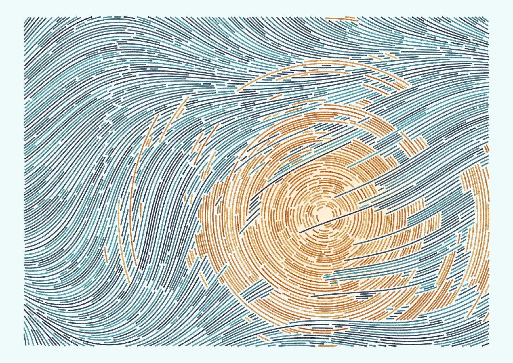

# Plotting packages

```{r setup, include=FALSE}
knitr::opts_chunk$set(warning = F, message = F)
library(igraph)
library(network)
```


```{r, echo = F}
edges_1mode <- read.csv('data/edgelist_onemode_projected.csv')
nodes_1mode <- read.csv('data/nodelist_onemode.csv')

net1 <- network(x = edges_1mode, 
               vertices = nodes_1mode,
               bipartite = F,  
               directed = F)
g1 <- igraph::graph_from_data_frame(edges_1mode, vertices = nodes_1mode, directed = F)
```

## `ggraph`  

For this workshop we will use the [`ggraph` package](https://cran.r-project.org/web/packages/ggraph/ggraph.pdf) (and function) for network visualization, created by Thomas Lin Pedersen, who also happens to make 'generative' artwork in R. 

```{r echo=FALSE, out.width= '75%', fig.show="hold", fig.align='center'}

```

`ggraph` uses the same approach as the `ggplot2` grammar of graphics. This means is has three core components: 1. (network) data, 2. aesthetic mappings, and 3. geometries, in this case edges and nodes. Where this differs from more traditional ggplotting approaches using tabular data (e.g. data frames), network objects have built-in mapping coordinates for nodes and its. Specifically, there are x and y variables for the node data. We can combine the `ggraph()` function with a geometry specific to networks, `geom_node_point()`, to see this default setting.

```{r, message = T, fig.align='center'}
library(ggraph)
ggraph(net1) +
    geom_node_point()
```

Here we see that the node point geometry uses a default layout based on the 'stress' algorithm (more in the following section), plotting the node points as we see above. To connect these point, we can use a 'edge link' geometry, `geom_edge_link()`, which uses the network object's built in x, y, xend, and yend variables for the edge data.

```{r, message = T, fig.align='center'}
ggraph(net1) +
    geom_node_point() +
    geom_edge_link()
```

This will be the foundation what we build on, starting in the next section. 

## Other packages and functions  

There are several plotting packages out there, some of them work with different network objects and requiring different knowledge. Excellent overviews of some of them are provided in this [post by Katya Ognyanova](https://kateto.net/network-visualization). I won't need to repeat these, but it is worth seeing the basic representation and understanding how `igraph` vs. `network` objects look differently in them, by default. 

### `plot()`

Base R plotting works with network and igraph objects, though their defaults for each object are different. 

```{r, out.width=c('49%', '49%'), fig.show="hold"}
plot(net1)
plot(g1)
```

### `GGally::ggnet2()`

The [`ggnet2` function](https://briatte.github.io/ggnet/) is also dynamic, but despite being housed as part of the `GGally` extension of the ggplot2 series it seems to function more like a base R plot. For this function, `igraph` and `network` objects look the same. 

```{r, out.width='49%', fig.align='center'}
GGally::ggnet2(net1)
```

### `ggnetwork::ggnetwork()`

Very similar to `ggraph` and also an extension of the ggplot family is the [`ggnetwork` function](https://cran.r-project.org/web/packages/ggnetwork/vignettes/ggnetwork.html). This function integrates directly with `ggplot2` and specifies the default coordinates of `ggraph`, but otherwise operates quite similarly. For this function, `igraph` and `network` objects look the same.  


```{r, out.width='50%', fig.align='center'}
library(ggplot2)
library(ggnetwork)
ggplot(net1, aes(x = x, y = y, xend = xend, yend = yend)) +
  geom_nodes() +
  geom_edges()
```

